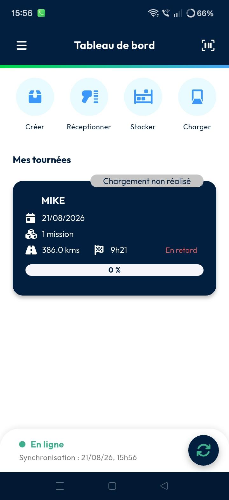

# Exécution - Mon itinéraire

Le **Ma tournée** La page donne aux chauffeurs accès à toutes les tournées de livraison actuellement attribuées à leur compte. Les utilisateurs peuvent suivre l'avancement des livraisons, accéder à la navigation et effectuer des tâches de traitement directement depuis leur appareil mobile. Cette fonctionnalité garantit une synchronisation en temps réel entre les actions du chauffeur et le système back-office.

#### Prise en main

Pour accéder à votre travail attribué, assurez-vous de remplir ces conditions :

* Valide **Nomadia Delivery** compte mobile.
* Au moins une tournée attribuée à votre profil.
* Les opérations de chargement de la tournée en cours sont terminées.
* Ouvrez l' **application mobile de livraison**.
* Accédez à Mes tournées

<figure><figcaption></figcaption></figure>

#### Aperçu de la fonctionnalité

* Le **Mes tournées** La page affiche toutes les tournées actuellement attribuées à l'utilisateur connecté. Elle fournit un espace de travail centralisé pour gérer les opérations de livraison quotidiennes et suivre l'avancement des tournées. Chaque carte de tournée affiche les informations essentielles, notamment le nom de la tournée, les missions attribuées, l'avancement de la livraison et le statut actuel de la tournée. Les utilisateurs peuvent sélectionner une tournée pour afficher des informations détaillées, accéder à la navigation, suivre l'exécution des missions et effectuer des actions liées à la livraison. Cette page aide les chauffeurs à gérer efficacement les tournées qui leur sont attribuées et à rester informés des activités de livraison tout au long de la journée.

<figure><figcaption></figcaption></figure>

* **Page d'exécution**: S'ouvre automatiquement si les opérations de chargement sont déjà terminées.
* **Nom de la tournée**: Affiche l'identifiant de la tournée active en haut de l'écran.
* **Barre de progression**: Suit visuellement les arrêts en cours, terminés et restants.
* **Vue de la carte**: Fournit une représentation visuelle de la séquence de la tournée et des emplacements des machines.
* **Trois points**: Accédez à des actions d'opération telles que **Actualiser ma tournée** ou **Optimiser ma tournée**.
* **Liste des missions**: Affiche des cartes pour chaque mission contenant les informations client et le statut de livraison.

<figure><figcaption></figcaption></figure>

#### Comment faire : interagir avec les clients

1. Repérez la **mission** correspondante dans votre liste.
2. Appuyez sur l' **icône téléphone** pour afficher le numéro de téléphone du client et l'appeler.

<figure><figcaption></figcaption></figure>

3. Appuyez sur l' **Navigation** icône pour lancer Google Maps et obtenir un guidage détaillé jusqu'à l'emplacement du client. Cela aide les chauffeurs à se rendre rapidement à destination.

<figure><figcaption></figcaption></figure>

#### Comment charger

Reportez-vous au lien suivant pour accéder à la page de chargement. [https://app.gitbook.com/o/oWGpSeZsFYIlc5oQ3d3d/s/Nos1xNJbOzIyAIJFYYCX/main\_actions/deposit/mobile\_loading](/broken/pages/4b7a3c8319381f49b8369f2d57a7c89c28ee3507)

#### Comment démarrer une tournée

1. Terminez le processus de chargement.
2. Une fois le chargement terminé, l' **Démarrer ma tournée** option s'affiche.
3. Appuyez sur **Démarrer ma tournée** pour commencer votre tournée.

<figure><figcaption></figcaption></figure>

#### Comment faire : effectuer une livraison

1. Ouvrez l' **mission** carte une fois que vous avez atteint la destination.
2. Appuyez sur l' **Bouton de lecture** pour commencer le processus.

<figure><figcaption></figcaption></figure>

3. Pour terminer une livraison, appuyez sur **Livraison** et scannez le code QR ou le code-barres du colis. Une fois le scan réussi, vous pouvez poursuivre le processus de confirmation de livraison.

<figure><figcaption></figcaption></figure>

4. Appuyez longuement sur la livraison pour sélectionner **Validation sans scan** si une saisie manuelle est nécessaire.
5. Appuyez sur **Confirmer** dans la fenêtre de validation.

<figure><figcaption></figcaption></figure>

6. Appuyez sur l' **Flèche droite** pour passer à l'étape de preuve de livraison et prendre une photo du colis livré. La photo sert de preuve que la livraison a été effectuée avec succès.

<figure><figcaption></figcaption></figure>

7. Appuyez sur l' **Coche** pour passer à l'écran de capture de signature. Demandez au destinataire de signer sur l'appareil pour confirmer la bonne réception du colis.
8. Appuyez sur l' **Flèche suivante** pour passer à l'étape de confirmation finale et fournir la signature du livreur. Cette signature confirme que le processus de livraison est terminé.

<figure><figcaption></figcaption></figure>

9. Appuyez sur **Confirmer** pour valider les détails de livraison et finaliser le processus de livraison. Les informations de livraison sont ensuite synchronisées avec le système back-office.

<figure><figcaption></figcaption></figure>

#### Synchronisation du back-office

Une fois la livraison confirmée :

* Le statut de livraison est mis à jour dans le back-office.
* Les missions livrées apparaissent en vert.
* Les signatures capturées sont disponibles dans le back-office.
* Les photos de livraison sont disponibles dans le back-office.
* Les journaux de livraison sont mis à jour automatiquement.

<figure><figcaption></figcaption></figure>

